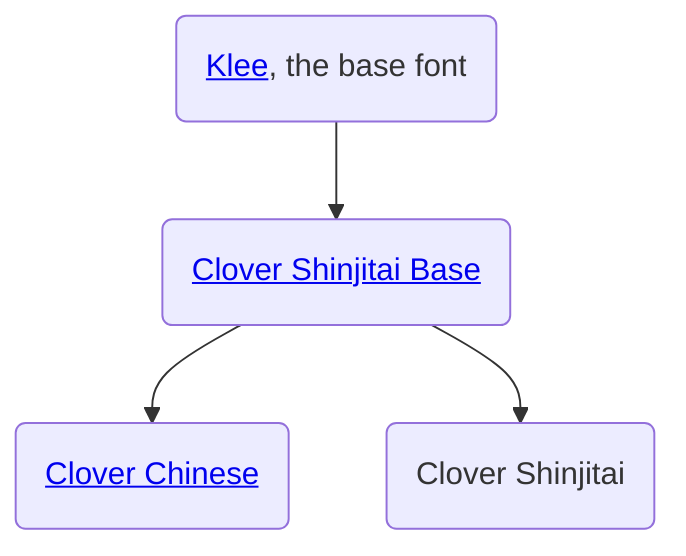

 

<h1 align="center">Klee Extended / Clover 白詰</h1>

_A series of forks of Klee One currently in development by [@furuochen-dev](https://github.com/furuochen-dev)_

## Upstreams tree diagram:

## Descriptions:

### Clover Shinjitai Base / Klee Extended Shinjitai Base:
Unifies all inconsistencies between 新字体(*Shinjitai*) and 旧字体(*Kyuujitai*) 
with 表外汉字(*Hyougai Kanji*), unifying the components like "曾", "羽", "辶(辵)", etc..

### Clover Chinese / Klee Extended Chinese:
Tries to cover Chinese (current plan GB2312) (currently unfinished)

### Clover Shinjitai / Klee Extended Shinjitai:
Tries to cover Extended Shinjitai characters (not yet started)

<i>*Clover is an alternative name for "Klee Extended"</i>

